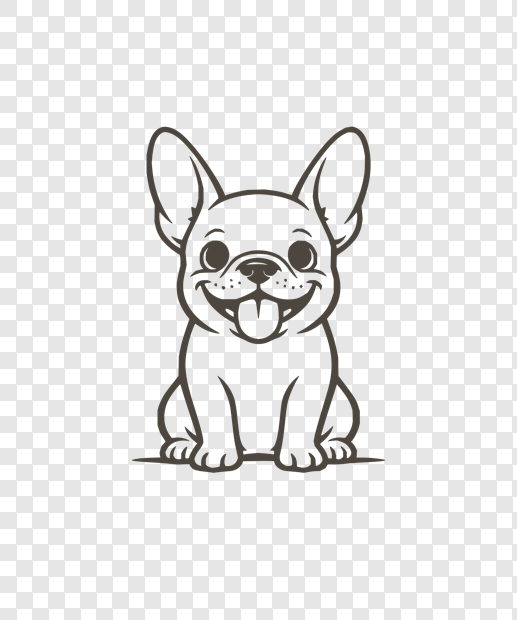
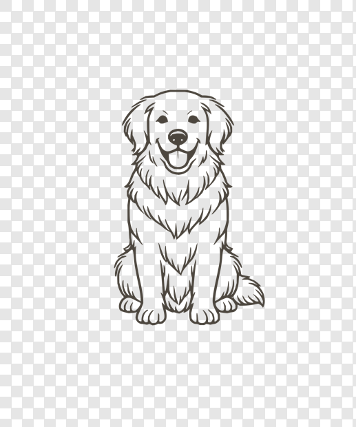
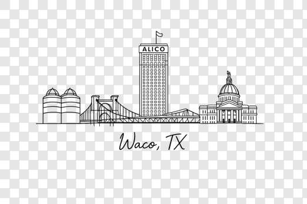
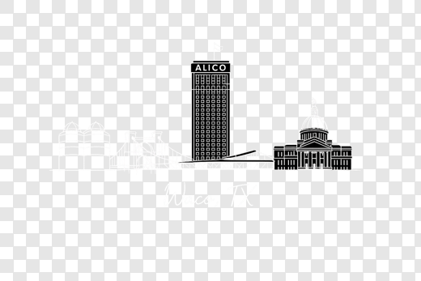

# Test Batch Artwork Review — Phase 2

**Date:** 2026-07-01
**Masters location:** `merch-launch/artwork/{design}/`
**Validation:** `output/PRODUCTION_MASTER_VALIDATION.json`

Two designs passed to production-master quality; one is held for reconstruction.

---

## 1. French Bulldog Tee — **PASS**

| Field | Value |
|-------|-------|
| Source used | `KWW_Production_Packet.pdf` p5 xref62 → `source/french_bulldog_light_x62.png` (1024×1024 transparent) |
| Reconstruction performed | Vector trace (potrace) → SVG → rendered at print size (rsvg-convert). Not a bitmap upscale. |
| Final dimensions | 4500 × 5400, RGBA, transparent, 300 DPI |
| Margins (L,T,R,B) | 1147 / 1102 / 1147 / 1281 px (all > 150) |
| Print colors | Bark Brown `#4C463E` (single-color line art) |
| Recommended CC1717 garments | Ivory, Bay (sage), Blue Jean/Chambray, Blossom |
| Dark version | Not needed (Pepper not curated for breed tees) |
| Remaining concern | Preview-res source; confirm line weight at 100% zoom; skyline pairing pending Waco |
| **Status** | **PASS** |

---

## 2. Golden Retriever Tee — **PASS**

| Field | Value |
|-------|-------|
| Source used | `KWW_Production_Packet.pdf` p5 xref66 → `source/golden_retriever_light_x66.png` (1024×1024 transparent) |
| Reconstruction performed | Vector trace (potrace) → SVG → rendered at print size (rsvg-convert) |
| Final dimensions | 4500 × 5400, RGBA, transparent, 300 DPI |
| Margins (L,T,R,B) | 1441 / 1134 / 1153 / 1285 px (all > 150) |
| Print colors | Bark Brown `#4C463E` (single-color line art) |
| Recommended CC1717 garments | Ivory, Bay (sage), Blue Jean/Chambray, Blossom |
| Dark version | Not needed (Pepper not curated for breed tees) |
| Remaining concern | Preview-res source; confirm line weight parity with Frenchie; skyline pairing pending Waco |
| **Status** | **PASS** |

---

## 3. Waco Skyline Tee — **HOLD (REQUIRES_RECONSTRUCTION)**

**Reference — light (for light garments):**

**Reference — white-line (for dark garments):**

| Field | Value |
|-------|-------|
| Source recovered | `source/waco_skyline_light_x26.png` + `source/waco_skyline_dark_x29.png` (1536×1024 transparent) |
| Reconstruction performed | **None** — no master faked |
| Real ALICO Building? | **Yes** in the source (labeled tower, silos, suspension bridge, courthouse) |
| Why held | ~128–154 DPI at print width; vector trace collapses the ALICO window grid into a solid tower (generic-tower brand violation). Upscaling a preview is disallowed. |
| Print colors (target) | light: Bark Brown `#4C463E`; dark: Kitchen Cream `#F4EDE4` |
| Recommended CC1717 garments | Ivory, Bay, Blue Jean/Chambray, Blossom; **Pepper only after** the dark/white-line master is rebuilt and passes contrast QA |
| Remaining concern | Needs clean vector redraw at production scale (see `artwork/waco-skyline-tee/notes.md`) |
| **Status** | **HOLD** |

---

## Summary

| Design | Master created | Dimensions | Transparent | 300 DPI | Status |
|--------|----------------|------------|-------------|---------|--------|
| French Bulldog Tee | Yes (light) | 4500×5400 | Yes | Yes | **PASS** |
| Golden Retriever Tee | Yes (light) | 4500×5400 | Yes | Yes | **PASS** |
| Waco Skyline Tee | No (held) | — | — | — | **HOLD — REQUIRES_RECONSTRUCTION** |

**Duplicate files:** none. **Blank canvases:** none. **Edge clipping:** none.

## Files to review visually

- `artwork/french-bulldog-tee/light.png`
- `artwork/golden-retriever-tee/light.png`
- `artwork/waco-skyline-tee/source/waco_skyline_light_x26.png` (reference)
- `artwork/waco-skyline-tee/source/waco_skyline_dark_x29.png` (reference)
- Contact sheets: `output/contact-sheets/`
- Reconstruction brief: `artwork/waco-skyline-tee/notes.md`
